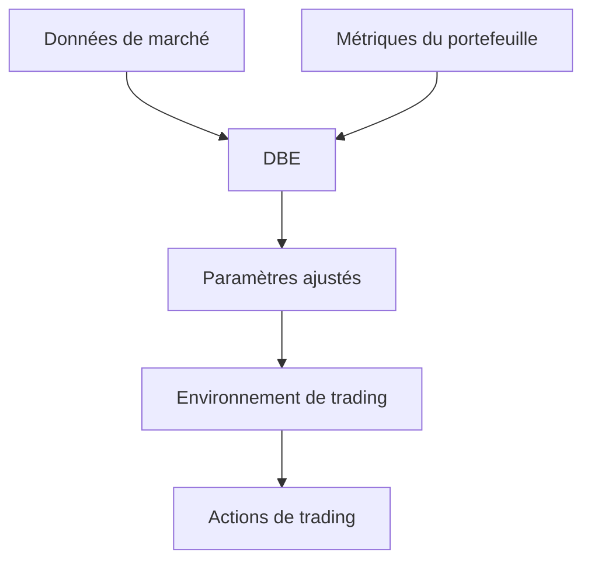

# Dynamic Behavior Engine (DBE)

## Vue d'ensemble
Le Dynamic Behavior Engine (DBE) est un composant clé du système de trading ADAN qui permet une adaptation dynamique des paramètres de trading en fonction des conditions du marché et de la performance du portefeuille. Il agit comme un système expert qui ajuste en temps réel les stratégies de trading pour optimiser les performances et gérer les risques.

## Fonctionnalités principales

### 1. Gestion dynamique du risque
- **Stop-Loss et Take-Profit adaptatifs** : Ajustement automatique des niveaux de sortie en fonction de la volatilité récente.
- **Taille de position dynamique** : Ajustement de la taille des positions en fonction de la confiance du modèle et des conditions de marché.
- **Modes de risque** : Bascule entre différents profils de risque (conservateur, équilibré, agressif) en fonction des conditions.

### 2. Détection des régimes de marché
- Identification des conditions de marché : tendance haussière, baissière, ou latérale.
- Adaptation des stratégies en fonction du régime détecté.
- Détection des périodes de forte volatilité.

### 3. Optimisation des récompenses
- Ajustement dynamique de la fonction de récompense pour encourager les comportements souhaités.
- Pénalisation des comportements à risque.
- Récompenses pour la cohérence des performances.

## Configuration

Le DBE est configuré via le fichier `environment_config.yaml` dans la section `dynamic_behavior` :

```yaml
dynamic_behavior:
  # Paramètres de gestion du risque
  risk_management:
    initial_sl_pct: 0.02  # Stop-loss initial (2%)
    initial_tp_pct: 0.04  # Take-profit initial (4%)
    max_position_size: 0.1  # Taille maximale de position (10% du capital)
    
  # Détection des régimes de marché
  market_regime_detection:
    volatility_lookback: 20  # Période de lookback pour le calcul de la volatilité
    trend_lookback: 50      # Période de lookback pour la détection de tendance
    
  # Paramètres d'adaptation
  adaptation:
    learning_rate: 0.01     # Vitesse d'adaptation des paramètres
    min_volatility: 0.005   # Volatilité minimale pour éviter les divisions par zéro
    max_volatility: 0.10    # Volatilité maximale pour le calcul des paramètres
```

## Intégration avec le système

Le DBE est intégré dans le `MultiAssetEnv` et est appelé à chaque étape du processus de trading pour :

1. Mettre à jour les métriques de performance
2. Ajuster les paramètres de trading
3. Fournir des signaux pour la prise de décision

## Méthodes principales

### `update_metrics(portfolio_metrics, market_data)`
Met à jour les métriques internes du DBE avec les dernières informations du portefeuille et du marché.

### `adjust_parameters()`
Ajuste les paramètres de trading en fonction des métriques actuelles.

### `get_trading_parameters()`
Retourne les paramètres de trading actuels (SL, TP, taille de position, etc.).

### `detect_market_regime(market_data)`
Analyse les données de marché pour déterminer le régime actuel.

## Flux de données



## Journalisation et surveillance

Le DBE enregistre ses décisions et ses paramètres dans un journal dédié pour analyse ultérieure. Les métriques clés sont :

- Paramètres de trading actuels (SL, TP, taille de position)
- Régime de marché détecté
- Métriques de performance
- Événements importants (changements de paramètres, signaux forts)

## Tests et validation

Le DBE inclut une suite de tests unitaires et d'intégration pour s'assurer de son bon fonctionnement dans différentes conditions de marché. Les tests couvrent :

- La détection précise des régimes de marché
- L'ajustement approprié des paramètres
- La robustesse face à des conditions de marché extrêmes
